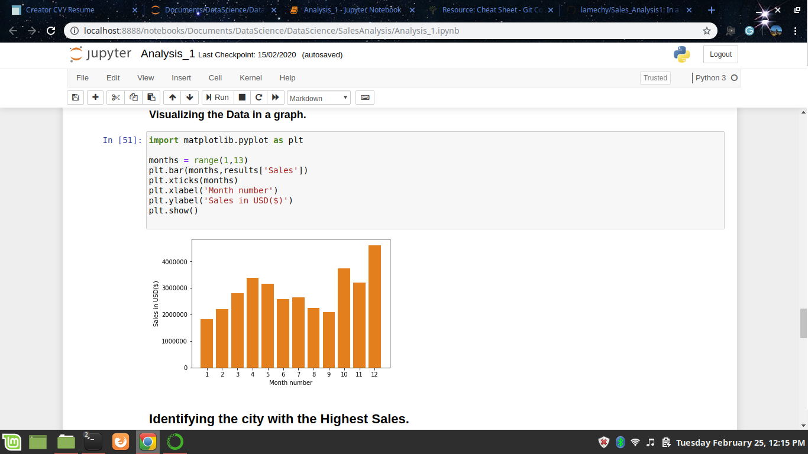

#  Project Name: Sales_Analysis.
#### Description:
 **In a bid to learn and practice on using Pandas, this is a project  that extensively analyses a U.S.A based Sales Data-set and try visualize it and bring a much sensible meaning out of the data.**
 

 ## Setup/Installation Requirements
 To run this project successfully I recommend that you have the relevant environment setup for this project, preferably;
 * Jupyter Notebook (click on this link to install:https://jupyter.readthedocs.io/en/latest/install.html)
  
 * Pandas library (checkout this link: https://pandas.pydata.org/pandas-docs/stable/install.html)

 ## Installation Guide 
 To access all of the files I recommend you fork this repo and then clone it locally. Instructions on how to do this can be found here: https://help.github.com/en/github/getting-started-with-github/fork-a-repo

Alternatively you can navigate to the command-prompt on Windows pc or terminal on linux and  run the following command;
'git clone https://github.com/lamechy/Sales_Analysis1.git`
'cd SalesAnalysis'
 
 ## Background information:

 In this project I used Python Pandas and Python Matplotlib to analyse a large dataset of electronic store purchases base on month, state, cost as key parameters while answering some key business questions.
 Started  by cleaning the given data. This involve;
 - Droping Nun-numbers from the DataFrame
 - Concat 12 months cvs files into one csv file using Pandas.
 - Removing/adding rows based on a condition.
 - Change the type of columns (to_numeric, to_datetime, astype)
 Once we have cleaned up our data a bit, we move the data exploration section and simple graphical visualization using matplotlib
 - What was the best month for sales? How much was earned that month?
- What city sold the most product?
### License
